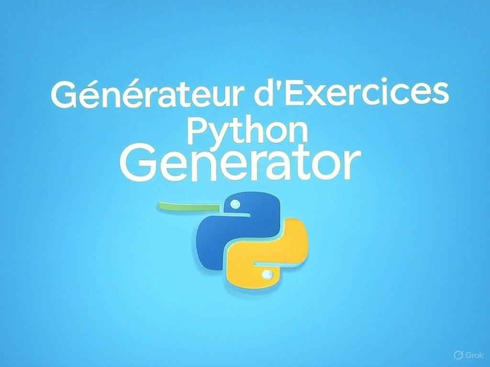

# Générateur d'Exercices Python avec IA

Une application web interactive pour générer des exercices de programmation Python personnalisés pour les élèves de lycée (Première et Terminale), avec évaluation automatique du code par intelligence artificielle.



## Fonctionnalités

- **Génération d'exercices personnalisés** : Création d'énoncés adaptés au niveau des élèves (Première ou Terminale)
- **Thèmes variés** : Couvre différents concepts de programmation Python selon le programme scolaire
- **Niveaux de difficulté** : Exercices adaptables selon les compétences des élèves
- **Éditeur de code intégré** : Interface conviviale avec coloration syntaxique
- **Exécution de code en temps réel** : Test immédiat des solutions proposées
- **Évaluation automatique** : Analyse du code et suggestions d'amélioration par IA
- **Double moteur d'IA** : Compatible avec LocalAI (Mistral) et Google Gemini

## Prérequis

- Python 3.8 ou supérieur
- LocalAI installé et configuré (pour le mode local) ou une clé API Gemini (pour le mode cloud)
- Navigateur web moderne

## Installation

1. Clonez ce dépôt :
   ```bash
   git clone https://github.com/votre-utilisateur/generateur-exercices-python.git
   cd generateur-exercices-python
   ```

2. Créez et activez un environnement virtuel :
   ```bash
   python -m venv .venv
   # Sur Windows
   .venv\Scripts\activate
   # Sur macOS/Linux
   source .venv/bin/activate
   ```

3. Installez les dépendances :
   ```bash
   pip install -r requirements.txt
   ```

## Configuration du Fournisseur d'IA

Au lieu d'utiliser un fichier `.env`, vous devez modifier le fichier `ai_provider.py` pour configurer votre fournisseur d'IA préféré.

Ouvrez `ai_provider.py` et modifiez les paramètres suivants :

```python
# Configuration pour LocalAI
LOCALAI_URL = "http://127.0.0.1:8080/v1/chat/completions"
LOCALAI_MODEL = "mistral-7b-instruct-v0.3"

# Configuration pour Gemini
GEMINI_API_KEY = "YOUR_API_KEY"  # Remplacez par votre clé API Gemini
GEMINI_MODEL = "gemini-2.0-flash"
```

### Recommandations de Configuration

#### Pour LocalAI :
- Assurez-vous que votre instance LocalAI est correctement configurée et accessible
- Vérifiez que l'URL pointe vers le bon endpoint de votre serveur LocalAI
- Utilisez le modèle Mistral approprié à votre installation

#### Pour Gemini :
- **IMPORTANT** : Remplacez `"YOUR_API_KEY"` par votre véritable clé API Gemini
- La clé API doit être gardée confidentielle
- Ne commitez jamais votre clé API dans le dépôt Git

Options de configuration :
- Sélectionnez le fournisseur d'IA en modifiant la variable `AI_PROVIDER` dans `ai_provider.py`
  - `AI_PROVIDER = 'localai'` pour utiliser LocalAI
  - `AI_PROVIDER = 'gemini'` pour utiliser Google Gemini

## Utilisation

1. Démarrez l'application :
   ```bash
   python app.py
   ```

2. Ouvrez votre navigateur à l'adresse : http://127.0.0.1:5000

3. Sélectionnez le niveau, le thème et la difficulté pour générer un exercice

4. Écrivez votre code dans l'éditeur intégré

5. Exécutez et évaluez votre code directement dans l'interface

## Déploiement sur la Forge Éducation

Pour déployer cette application sur la Forge Éducation :

1. Assurez-vous que tous les fichiers nécessaires sont présents :
   - Code source de l'application
   - Fichier `requirements.txt`
   - Fichier `ai_provider.py` avec la configuration appropriée
   - Dossier `exercices` avec le fichier `data.json`

2. Configurez les paramètres dans `ai_provider.py` selon l'environnement de la Forge Éducation

3. Suivez les instructions spécifiques de déploiement de la Forge Éducation

## Sécurité et Confidentialité

- Ne partagez jamais vos clés API publiquement
- Utilisez des variables d'environnement ou des mécanismes sécurisés pour stocker les clés sensibles
- Rotez régulièrement vos clés API

## Structure des données

Les exercices sont définis dans le fichier `exercices/data.json` avec la structure suivante :

```json
{
  "Niveau": [
    {
      "thème": "Nom du thème",
      "niveaux": [
        {
          "niveau": 1,
          "description": "Description de l'exercice"
        }
      ]
    }
  ]
}
```

Vous pouvez enrichir ce fichier avec de nouveaux thèmes et exercices en respectant cette structure.

## Contribution

Les contributions sont les bienvenues ! N'hésitez pas à :

1. Fork le projet
2. Créer une branche (`git checkout -b feature/amelioration`)
3. Commit vos changements (`git commit -m 'Ajout d'une fonctionnalité'`)
4. Push vers la branche (`git push origin feature/amelioration`)
5. Ouvrir une Pull Request

## Licence

Ce projet est sous licence [MIT](LICENSE).

## Crédits

- Développé pour l'Éducation Nationale
- Utilise [LocalAI](https://github.com/go-skynet/LocalAI) et [Gemini API](https://ai.google.dev/)
- Interface basée sur Bootstrap et CodeMirror